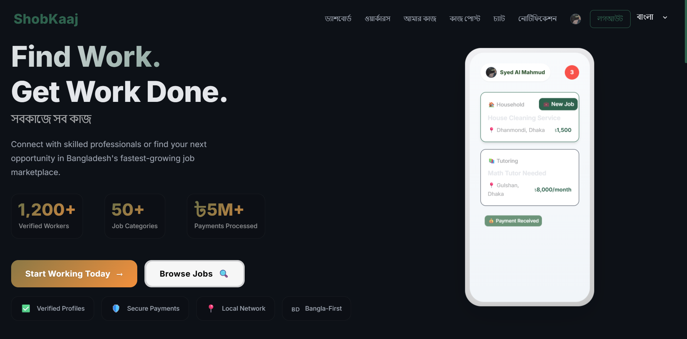

# 🛠️ ShobKaaj – Local Job & Service Finder App

<p align="center">
  
</p>

<p align="center">
  
  
  
  
</p>

**ShobKaaj** is a mobile application that connects clients with trusted local workers for a wide range of services — from household repairs and tutoring to delivery, freelance work, and errands.

It is designed to reduce employment gaps in **Bangladesh** by providing a **verified, location-based, and inclusive digital job marketplace** for both urban and rural communities.

---

## 📖 Table of Contents
*   **[Introduction](#-shobkaaj--local-job--service-finder-app)**
    *   [Problem Background](#-problem-background)
    *   [Our Solution](#-our-solution)
*   **[Technical Details](#-key-features)**
    *   [Key Features](#-key-features)
    *   [Tech Stack](#-tech-stack)
    *   [Built With](#-built-with)
    *   [Screenshots & Design](#-screenshots--design)
*   **[Project Status](#-project-status)**
*   **[Project Vision](#-vision)**
    *   [Vision](#-vision)
    *   [Roadmap](#-roadmap)
*   **[Getting Started](#-getting-started)**
    *   [Prerequisites](#-prerequisites)
    *   [Installation](#-installation)
    *   [Usage](#-usage)
    *   [Deployment](#-deployment)
*   **[Getting Involved](#-contributing)**
    *   [Contributing](#-contributing)
    *   [Code of Conduct](#-code-of-conduct)
*   **[Legal](#-license)**
    *   [License](#-license)
*   **[About](#-team)**
    *   [Team](#-team)
    *   [Contact](#-contact)
*   **[Support & Donations](#-support--donations)**
*   **[Changelog](#-changelog)**

---

## 🌍 Problem Background

In Bangladesh, many **skilled individuals** — students, freelancers, and laborers — struggle to find **consistent work** or **reliable clients**.

Meanwhile, **households, students, and small businesses** often need **quick, trustworthy help** for everyday tasks like:
- Home repairs
- Tutoring
- Deliveries
- Event setup
- Freelance work

👉 The core issue is the **absence of a centralized, safe, and user-friendly platform** to connect these skilled workers with clients effectively across all regions.

---

## ✅ Our Solution

ShobKaaj provides an **all-in-one mobile marketplace** where clients and workers can meet, collaborate, and grow.

### Core Benefits:

| Icon | Benefit | Description |
| :---: | :--- | :--- |
| 🗺️ | **GPS-based Matching** | Clients find nearby workers in real-time, reducing travel time and cost. |
| 👤 | **Verified Profiles** | A robust identity verification system ensures safety and trust for both parties. |
| 💬 | **In-app Messaging** | Communicate securely without needing to share personal phone numbers. |
| ⭐ | **Ratings & Reviews** | Workers build reputation and reliability through transparent feedback. |
| 💸 | **Secure Payments** | Integrated digital wallet (**bKash/Nagad**) for safe and easy transactions. |
| 🌐 | **Bangla-First Interface** | Designed for maximum accessibility across all user demographics in Bangladesh. |

---

## 🎯 Key Features

### For Clients
- Post jobs instantly with clear requirements.
- Browse worker profiles by category, skills, and location.
- Chat, hire, and manage bookings entirely in-app.
- Leave ratings & reviews immediately after work is complete.

### For Workers
- Create detailed, professional profiles showcasing skills and experience.
- Get real-time job alerts based on location and skill set.
- Apply for jobs with a single click and manage multiple applications.
- Receive ratings and badges to increase credibility and trust.
- Manage secure payments inside the application.

### Universal Tools
- 🔒 **Identity Verification:** Mandatory checks to ensure a safe environment.
- 📢 **Smart Notifications:** Real-time alerts for new jobs, messages, and payment updates.
- 🌱 **Digital Inclusion:** Built-in support for rural and first-time digital users (e.g., low-data mode).
- 🏅 **Trust & Credibility:** Badges, trust levels, and performance metrics for top performers.

---

## 🚀 Tech Stack

| Component | Technology | Description |
| :--- | :--- | :--- |
| **Mobile App** | **React Native / Expo** | Provides a single codebase for a seamless cross-platform experience. |
| **Platform** | Cross-platform (**Android & iOS**) | Ensures wide reach on both major mobile operating systems. |
| **Location Services** | GPS/Geo-location APIs | Enables real-time, proximity-based job and worker matching. |
| **Payments** | **bKash & Nagad APIs** | Secure, integrated digital wallet functionality for local transactions. |
| **Messaging** | WebSockets & Push Notifications | Powers real-time, secure in-app chat. |
| **Backend** | **Node.js, Express.js** | Designed for high scalability and reliability. |
| **Database** | **MongoDB** | For storing user data, job postings, and other application data. |

---

## 🏗️ Built With

*   [React Native](https://reactnative.dev/) - The framework used for building the mobile app.
*   [Expo](https://expo.dev/) - The platform for making universal native apps.
*   [Node.js](https://nodejs.org/) - The JavaScript runtime used for the backend.
*   [Express.js](https://expressjs.com/) - The backend framework for Node.js.
*   [MongoDB](https://www.mongodb.com/) - The NoSQL database used for the application.

---

## 📷 Screenshots & Design

_Visual preview of ShobKaaj is coming soon!_

🔗 **Figma Prototype (Demo):** [View Prototype on Figma](https://www.figma.com/design/jJarzBaAAiTopQT5vsmdqY/Final-Project?node-id=0-)

---

## 📊 Project Status

This project is currently **in development**.

---

## 📌 Vision

ShobKaaj is **more than just a gig platform**. We aim to be a core driver of digital and economic inclusion in Bangladesh by:

- 🏘️ **Empowering Rural Workers:** Providing digital access and opportunities to skilled individuals in remote areas.
- 📱 **Promoting Digital Inclusion:** Making digital work and payments accessible to everyone, regardless of technical proficiency.
- 🤝 **Building Trust:** Creating a transparent, verified, and safe environment for all transactions.
- 📈 **Contributing to Economic Growth:** Supporting a vibrant economy through flexible, reliable work opportunities.

---

## 🗺️ Roadmap

### ✅ MVP (Minimum Viable Product)
- [x] User authentication (client & worker roles)
- [x] Basic job posting & browsing functionality
- [x] Worker profile creation and management
- [x] Functional in-app chat system
- [x] Location-based worker matching

### 🚧 Beta Release
- [ ] Ratings & reviews system for all completed jobs.
- [ ] Payment gateway integration (bKash/Nagad).
- [ ] Push notifications for job updates and messages.
- [ ] Enhanced rural user support (low-data mode, optimized Bangla UI).
- [ ] Admin dashboard for monitoring jobs, user verification, and disputes.

### 🌍 Full Launch
- [ ] Advanced analytics and performance dashboards for users.
- [ ] Trust badges and verification tiers for highly-rated workers.
- [ ] Full multi-language support (Bangla, English).
- [ ] AI-powered job and worker recommendation system.
- [ ] Aggressive expansion strategy across all rural districts in Bangladesh.

---

## 🚀 Getting Started

To get a local copy up and running follow these simple example steps.

### Prerequisites

*   npm
    ```sh
    npm install npm@latest -g
    ```

### Installation

1.  Clone the repo
    ```sh
    git clone https://github.com/mahito-0/Software-Engineering.git
    ```
2.  Install NPM packages
    ```sh
    npm install
    ```

### Usage

_Usage instructions will be available soon!_

### Deployment

_Deployment instructions will be available soon!_

---

## 🤝 Contributing

Contributions are what make the open source community such an amazing place to learn, inspire, and create. Any contributions you make are **greatly appreciated**.

1.  Fork the Project
2.  Create your Feature Branch (`git checkout -b feature/AmazingFeature`)
3.  Commit your Changes (`git commit -m 'Add some AmazingFeature'`)
4.  Push to the Branch (`git push origin feature/AmazingFeature`)
5.  Open a Pull Request

We have a `PULL_REQUEST_TEMPLATE.md` file in the root directory of this project. Please follow the template when creating a pull request.

### Code of Conduct

Please read our [Code of Conduct](CODE_OF_CONDUCT.md) to keep our community approachable and respectable.

---

## 📜 License

Distributed under the MIT License. See `LICENSE` for more information.

---

## 👨‍💻 Team

*   **Syed Al Mahmud** - [GitHub](https://github.com/mahito-0)

---

## 📧 Contact

For any inquiries, please email us at [mahmud.agni@gmail.com](mailto:mahmud.agni@gmail.com)

---

## ❤️ Support & Donations

If you like this project, please consider supporting it by making a donation. We appreciate your support!

[Donate Now](https://www.buymeacoffee.com/your-username) (placeholder)

---

## 📜 Changelog

See the [Changelog](CHANGELOG.md) for a history of changes to this project.
